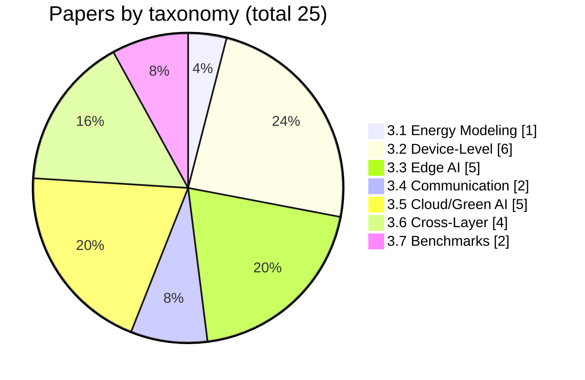
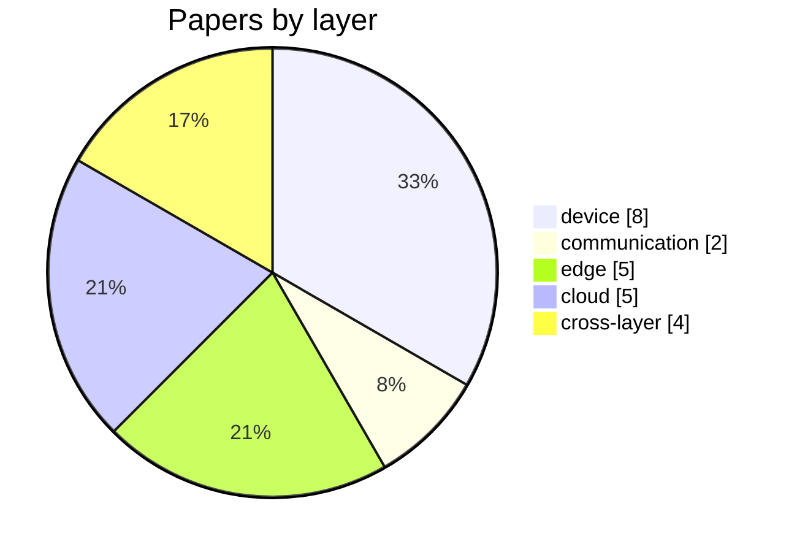
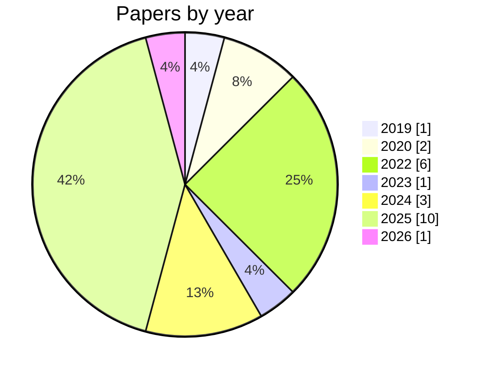
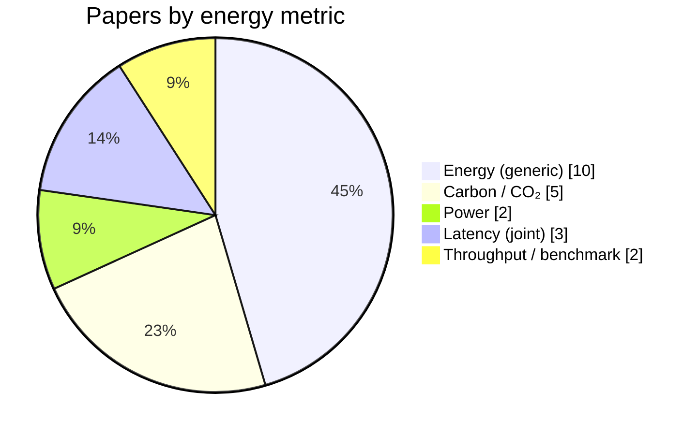

# Energy-Aware and Energy-Efficient AIoT Systems
## Architectures, Optimization, and Open Challenges

A structured survey repository for **energy-aware** and **energy-efficient** Artificial Intelligence of Things (**AIoT**) systems—focusing on how AIoT consumes energy and how to model, reduce, and manage it across the full stack (device, communication, edge, cloud).

> **Scope note:** This survey addresses the **energy of AIoT** (modeling, measurement, and optimization of energy in AIoT systems). It does *not* cover AI applications for energy infrastructure (e.g., smart grid, demand response).

---

## What This Survey Covers

AIoT combines **sensing**, **communication**, **edge intelligence**, and **cloud-scale AI**, turning IoT from lightweight data collection into a compute-intensive ecosystem. Key questions we address:

- How is energy consumed across the AIoT stack (device, communication, edge, cloud)?
- How can energy be **modeled, measured, and monitored** in a comparable way?
- How can **cross-layer optimization** reduce total system energy while meeting latency and accuracy goals?
- How can AIoT align with **sustainable computing** (energy and carbon)?

**Goal:** This repo is designed so that visitors can **identify research gaps**—not only browse paper lists. All paper lists, comparison tables, statistics, trends, and **open problems** are in this README for easy indexing.

---

## Table of Content

- [1. Scope](#1-scope)
  - [Included](#included) · [Excluded](#excluded)
- [2. AIoT Energy Stack](#2-aiot-energy-stack)
- [3. Research Taxonomy & Paper Lists](#3-research-taxonomy--paper-lists)
  - [3.1 Energy Modeling](#31-energy-modeling-in-aiot)
  - [3.2 Device-Level Optimization](#32-device-level-energy-optimization)
  - [3.3 Edge AI Energy](#33-edge-ai-energy-optimization)
  - [3.4 Communication Energy](#34-communication-energy-optimization)
  - [3.5 Cloud and Green AI](#35-cloud-and-green-ai-for-aiot-pipelines)
  - [3.6 Cross-Layer Optimization](#36-cross-layer-energy-optimization)
  - [3.7 Benchmarks and Metrics](#37-benchmarks-datasets-and-metrics)
  - [3.8 Open Challenges](#38-open-challenges)
- [4. 📊 Paper Comparison Tables](#4--paper-comparison-tables)
  - [By energy metric](#by-energy-metric)
  - [By dataset](#by-dataset)
  - [By layer](#by-layer)
- [5. 🗂 Classification Statistics](#5--classification-statistics)
- [6. 📈 Publication Trends](#6--publication-trends)
- [7. Paper Collection Criteria](#7-paper-collection-criteria)
- [8. Keywords](#8-keywords)
- [9. 📌 Open Problems and Research Gaps](#9--open-problems-and-research-gaps)

---

<a name="1-scope"></a>
## 1. Scope

<a name="included"></a>
### Included ✅

- **Energy modeling and measurement** for AIoT systems (power profiling, estimation, carbon footprint).
- **Device-level energy efficiency:** TinyML, ultra-low-power sensing, duty cycling, wake-up radios, energy harvesting.
- **Energy-aware edge computing:** offloading, scheduling, edge inference, federated learning energy cost.
- **Communication energy optimization:** transmission power, energy-efficient protocols, communication–computation trade-offs, data compression for transmission.
- **Green AI and carbon-aware computing** relevant to AIoT pipelines (scheduling, training, data centers).
- **Cross-layer energy optimization:** end-to-end and co-design across sensing, communication, edge, and cloud.
- **Benchmarks, datasets, and metrics:** energy, carbon, EDP, throughput-per-watt, and evaluation protocols.

<a name="excluded"></a>
### Excluded ❌

- Smart grid engineering, power system operation, and energy market optimization.
- Renewable generation forecasting, unless directly tied to carbon-aware computing.
- Pure model compression or algorithm-only work **without** system-level energy evaluation.

---

<a name="2-aiot-energy-stack"></a>
## 2. AIoT Energy Stack (Layered View)

Energy consumption in AIoT can be decomposed into the following layers; energy, latency, and accuracy are coupled across them.

```
Device Layer          sensing + on-device AI (TinyML, sensing)
        ↓
Communication Layer  wireless + networking
        ↓
Edge Layer            edge inference + orchestration
        ↓
Cloud / Data Center   training + coordination
```

---

<a name="3-research-taxonomy--paper-lists"></a>
## 3. Research Taxonomy & Paper Lists

<a name="31-energy-modeling-in-aiot"></a>
### 3.1 Energy Modeling in AIoT

**Focus:** Power/energy modeling for inference and edge workloads; measurement methodologies (hardware counters, external meters, profiling); carbon footprint estimation; performance-per-watt evaluation.

**Key questions:** How to quantify energy across device, edge, and cloud in a comparable way? How accurate are estimation-based vs measurement-based approaches? What metrics should become standard for AIoT energy evaluation?

**Papers**

| Title | Year | Venue | Layer(s) | Metric(s) | Dataset | Link |
|-------|------|-------|----------|-----------|--------|------|
| MLPerf Power: Benchmarking the Energy Efficiency of ML Systems from Microwatts to Megawatts | 2024 | arXiv / MLPerf | device, edge, cloud | energy, power | MLPerf suite | [arXiv](https://arxiv.org/abs/2410.12032) |

---

<a name="32-device-level-energy-optimization"></a>
### 3.2 Device-Level Energy Optimization (TinyML + Sensing)

**Focus:** TinyML efficiency (quantization, pruning, distillation, NAS for MCUs); ultra-low-power and event-driven sensing; duty cycling and wake-up radios; energy harvesting integration.

**Key questions:** How to enable useful intelligence under strict power budgets? How to trade off accuracy, energy, and memory on constrained devices?

**Papers**

| Title | Year | Venue | Layer(s) | Metric(s) | Dataset | Link |
|-------|------|-------|----------|-----------|--------|------|
| PolyThrottle: Energy-efficient Neural Network Inference on Edge Devices | 2023 | arXiv | device, edge | energy (savings %) | Popular DNNs | [arXiv](https://arxiv.org/abs/2310.19991) |
| tinyMAN: Lightweight Energy Manager using RL for Energy Harvesting Wearable IoT | 2022 | TinyML | device | μJ/inference, latency | Custom | [TinyML](https://cms.tinyml.org/wp-content/uploads/talks2022/2202.09297.pdf) |
| MinUn: Accurate ML Inference on Microcontrollers | 2022 | arXiv | device | memory | ARM MCUs | [arXiv](https://arxiv.org/abs/2210.16556) |
| TinyOps: ImageNet Scale Deep Learning on Microcontrollers | 2022 | CVPR Workshop | device | latency, accuracy | ImageNet | [CVF](https://openaccess.thecvf.com/content/CVPR2022W/ECV/papers/Sadiq_TinyOps_ImageNet_Scale_Deep_Learning_on_Microcontrollers_CVPRW_2022_paper.pdf) |
| Ultralow-Power Smart IoT Device with Embedded TinyML for Asset Monitoring | 2022 | IEEE | device | power (mW), battery life | Custom | [IEEE](https://ieeexplore.ieee.org/document/9758676) |
| Deploying TinyML for Energy-Efficient Object Detection in Low-Power Edge AI | 2025 | Scientific Reports | device | energy (J/inference), latency | Custom | [Nature](https://www.nature.com/articles/s41598-025-27818-9) |

---

<a name="33-edge-ai-energy-optimization"></a>
### 3.3 Edge AI Energy Optimization

**Focus:** Energy-aware task offloading (device ↔ edge ↔ cloud); joint latency–energy optimization; edge scheduling and resource management; federated learning energy cost and optimization.

**Key questions:** When is local inference more energy-efficient than offloading (total system energy)? How to meet latency and accuracy constraints with minimal energy?

**Papers**

| Title | Year | Venue | Layer(s) | Metric(s) | Dataset | Link |
|-------|------|-------|----------|-----------|--------|------|
| EdgeSight: Enabling Modeless and Cost-Efficient Inference at the Edge | 2024 | arXiv | edge | power (3.34× reduction) | FPGA prototype | [arXiv](https://arxiv.org/abs/2405.19213) |
| Infer-EDGE: Dynamic DNN Inference Optimization in Just-in-time Edge-AI | 2025 | arXiv | edge | energy, latency, accuracy | Video processing | [arXiv](https://arxiv.org/html/2501.18842) |
| Energy-Aware Inference Offloading for DNN-Driven Applications in Mobile Edge Clouds | 2020 | IEEE/ACM | edge | energy, latency | 5G MEC | [CityU](https://www.cs.cityu.edu.hk/~weliang/papers/XZLRZXXW20.pdf) |
| BEFL: Balancing Energy Consumption in Federated Learning for Mobile Edge IoT | 2024 | arXiv | edge | energy (28.2% reduction) | FL benchmarks | [ADS](https://ui.adsabs.harvard.edu/abs/2024arXiv241203950J/abstract) |
| Energy-Efficient Edge Inference in Integrated Sensing, Communication, and Computation Networks | 2025 | arXiv | edge | energy (40% reduction) | Low-latency scenarios | [arXiv](https://arxiv.org/html/2503.00298) |

---

<a name="34-communication-energy-optimization"></a>
### 3.4 Communication Energy Optimization

**Focus:** Transmission power control and energy-efficient protocols; communication–computation trade-offs in AIoT; efficient data representation and compression to reduce transmission energy; 5G/6G energy efficiency.

**Key questions:** Is communication or computation the dominant energy cost in typical deployments? How to jointly optimize network and inference for energy?

**Papers**

| Title | Year | Venue | Layer(s) | Metric(s) | Dataset | Link |
|-------|------|-------|----------|-----------|--------|------|
| Energy-Aware Federated Learning for Secure Edge Computing in 5G-Enabled IoT | 2025 | JESIT | communication, edge | energy, communication cost | IoT FL | [Springer](https://jesit.springeropen.com/articles/10.1186/s43067-025-00203-2) |
| Energy-Efficient Collaborative Task Computation Offloading in Cloud-Assisted Edge for IoT | 2019 | PMC | communication, edge | energy | IoT sensors | [PMC](https://pmc.ncbi.nlm.nih.gov/articles/PMC6427149/) |

---

<a name="35-cloud-and-green-ai-for-aiot-pipelines"></a>
### 3.5 Cloud and Green AI for AIoT Pipelines

**Focus:** Carbon-aware and renewable-aware scheduling; energy-efficient distributed training relevant to AIoT; sustainable data centers and AI carbon accounting; AIoT pipeline aspects (model updates, retraining frequency, lifecycle impact).

**Key questions:** How to reduce the lifecycle carbon cost of AIoT intelligence? Can carbon-aware scheduling reduce emissions without degrading SLAs?

**Papers**

| Title | Year | Venue | Layer(s) | Metric(s) | Dataset | Link |
|-------|------|-------|----------|-----------|--------|------|
| CarbonGearRL: Precision-Elastic, Carbon-Aware Scheduling for Foundation-Model Training | 2025 | OpenReview (ICLR?) | cloud | CO₂-e (52% reduction) | LLaMA 13B/70B | [OpenReview](https://openreview.net/forum?id=WRSveTJRtG) |
| EcoServe: Designing Carbon-Aware AI Inference Systems | 2025 | arXiv | cloud | carbon (47% reduction) | LLM inference | [arXiv](https://arxiv.org/abs/2502.05043) |
| GREEN: Carbon-efficient Resource Scheduling for Machine Learning Clusters | 2025 | NSDI | cloud | carbon (41.2% reduction) | ML clusters | [USENIX](https://www.usenix.org/conference/nsdi25/presentation/xu-kaiqiang) |
| Carbon- and Precedence-Aware Scheduling for Data Processing Clusters (PCAPS) | 2025 | SIGCOMM | cloud | carbon (32.9% reduction) | K8s cluster | [MIT](https://dspace.mit.edu/handle/1721.1/162640) |
| CarbonFlex: Carbon-aware Provisioning and Scheduling for Cloud Clusters | 2025 | arXiv | cloud | carbon (~57% reduction) | Batch jobs | [arXiv](https://arxiv.org/html/2505.18357) |

---

<a name="36-cross-layer-energy-optimization"></a>
### 3.6 Cross-Layer Energy Optimization (System-Level)

**Focus:** End-to-end energy optimization across sensing, communication, edge, and cloud; cross-layer co-design (hardware–model–system); orchestration policies (energy-aware placement, adaptive inference); multi-objective optimization (energy, latency, accuracy, privacy).

**Key questions:** How to coordinate all layers to minimize total system energy? Where are the bottlenecks, and how to design scalable controllers?

**Papers**

| Title | Year | Venue | Layer(s) | Metric(s) | Dataset | Link |
|-------|------|-------|----------|-----------|--------|------|
| Energy-Efficient Edge Inference in Integrated Sensing, Communication, and Computation Networks | 2025 | arXiv | cross-layer | energy | ISCC | [arXiv](https://arxiv.org/html/2503.00298) |
| MobiSplit: Mobility-Aware Inference Partitioning and Offloading for Efficient Edge Intelligence | 2026 | IEEE TMC | cross-layer | energy, latency | Mobile edge | [IEEE](https://www.computer.org/csdl/journal/tm/2026/03/11202426/2aMEEULKPMk) |
| Dynamic Task Offloading and Resource Allocation for Energy-Harvesting End–Edge–Cloud Systems | 2020+ | arXiv | cross-layer | energy | EH devices | [arXiv](https://arxiv.org/pdf/2006.10978) |
| EEDTO: Energy-Efficient Dynamic Task Offloading for Blockchain-Enabled IoT-Edge-Cloud | 2025 | TJU | cross-layer | energy | IoT-edge-cloud | [TJU](https://cam.tju.edu.cn/homepage/wuhuaming/PDF/EEDTO.pdf) |

---

<a name="37-benchmarks-datasets-and-metrics"></a>
### 3.7 Benchmarks, Datasets, and Metrics

**Focus:** Benchmark suites for edge, TinyML, and AIoT energy; tools for measurement and profiling; standardized evaluation protocols and reporting. Common metrics: energy per inference/sample, EDP, throughput per watt, carbon intensity.

**Papers**

| Title | Year | Venue | Layer(s) | Metric(s) | Dataset | Link |
|-------|------|-------|----------|-----------|--------|------|
| MLPerf Power: Benchmarking the Energy Efficiency of ML Systems from Microwatts to Megawatts | 2024 | arXiv / MLCommons | device–cloud | energy, power | MLPerf suite | [arXiv](https://arxiv.org/abs/2410.12032) |
| MLPerf Tiny (benchmark suite) | 2022+ | MLCommons | device | latency, energy | Keyword spotting, VWW, etc. | [MLCommons](https://mlcommons.org/working-groups/benchmarks/tiny/) |

---

<a name="38-open-challenges"></a>
### 3.8 Open Challenges

**Representative topics:** Lack of standardized benchmarks and reporting conventions for AIoT energy; trade-offs among energy, accuracy, latency, and privacy; security vs energy cost in real-world AIoT deployments; lifecycle carbon accounting (training, inference, updates); cross-layer coordination complexity at scale; reproducibility of real-world energy evaluation.

See **§9 📌 Open Problems and Research Gaps** below for the curated list of under-addressed questions.

---

<a name="4--paper-comparison-tables"></a>
## 4. 📊 Paper Comparison Tables

*Purpose: See which metrics/datasets/layers are over- or under-studied; find gaps.*

<a name="by-energy-metric"></a>
### By energy metric

| Metric | Papers |
|--------|--------|
| **mJ/μJ/J per inference** | [tinyMAN](https://cms.tinyml.org/wp-content/uploads/talks2022/2202.09297.pdf) (2022), [Deploying TinyML for Object Detection](https://www.nature.com/articles/s41598-025-27818-9) (2025) |
| **Energy (generic: %, reduction)** | [PolyThrottle](https://arxiv.org/abs/2310.19991), [EdgeSight](https://arxiv.org/abs/2405.19213), [Infer-EDGE](https://arxiv.org/html/2501.18842), [Energy-Efficient Edge Inference ISCC](https://arxiv.org/html/2503.00298), [BEFL](https://ui.adsabs.harvard.edu/abs/2024arXiv241203950J/abstract), [Energy-Aware Inference Offloading](https://www.cs.cityu.edu.hk/~weliang/papers/XZLRZXXW20.pdf), [MobiSplit](https://www.computer.org/csdl/journal/tm/2026/03/11202426/2aMEEULKPMk), [EEDTO](https://cam.tju.edu.cn/homepage/wuhuaming/PDF/EEDTO.pdf) |
| **Power (W, mW)** | [Ultralow-Power Smart IoT](https://ieeexplore.ieee.org/document/9758676), [EdgeSight](https://arxiv.org/abs/2405.19213) |
| **Carbon / CO₂** | [CarbonGearRL](https://openreview.net/forum?id=WRSveTJRtG), [EcoServe](https://arxiv.org/abs/2502.05043), [GREEN](https://www.usenix.org/conference/nsdi25/presentation/xu-kaiqiang), [PCAPS](https://dspace.mit.edu/handle/1721.1/162640), [CarbonFlex](https://arxiv.org/html/2505.18357) |
| **Latency (joint with energy)** | [MinUn](https://arxiv.org/abs/2210.16556), [TinyOps](https://openaccess.thecvf.com/content/CVPR2022W/ECV/papers/Sadiq_TinyOps_ImageNet_Scale_Deep_Learning_on_Microcontrollers_CVPRW_2022_paper.pdf), [Infer-EDGE](https://arxiv.org/html/2501.18842) |
| **Throughput / benchmark** | [MLPerf Power](https://arxiv.org/abs/2410.12032), [MLPerf Tiny](https://mlcommons.org/working-groups/benchmarks/tiny/) |

*Gap note: EDP (energy-delay product) is rarely reported.*

<a name="by-dataset"></a>
### By dataset

| Dataset / benchmark | Papers |
|---------------------|--------|
| **MLPerf (Tiny, Power)** | [MLPerf Power](https://arxiv.org/abs/2410.12032), [MLPerf Tiny](https://mlcommons.org/working-groups/benchmarks/tiny/) |
| **ImageNet** | [TinyOps](https://openaccess.thecvf.com/content/CVPR2022W/ECV/papers/Sadiq_TinyOps_ImageNet_Scale_Deep_Learning_on_Microcontrollers_CVPRW_2022_paper.pdf) |
| **Custom / application-specific** | [tinyMAN](https://cms.tinyml.org/wp-content/uploads/talks2022/2202.09297.pdf), [Ultralow-Power Smart IoT](https://ieeexplore.ieee.org/document/9758676), [Deploying TinyML](https://www.nature.com/articles/s41598-025-27818-9), [BEFL](https://ui.adsabs.harvard.edu/abs/2024arXiv241203950J/abstract), [Collaborative Task Offloading](https://pmc.ncbi.nlm.nih.gov/articles/PMC6427149/), [Energy-Aware FL 5G IoT](https://jesit.springeropen.com/articles/10.1186/s43067-025-00203-2) |
| **Foundation models / LLM** | [CarbonGearRL](https://openreview.net/forum?id=WRSveTJRtG) (LLaMA), [EcoServe](https://arxiv.org/abs/2502.05043) |
| **Video / DNN** | [Infer-EDGE](https://arxiv.org/html/2501.18842), [EdgeSight](https://arxiv.org/abs/2405.19213) |

*Gap note: Few papers share the same public dataset; reproducibility and comparison remain limited.*

<a name="by-layer"></a>
### By layer

| Layer | Papers (representative) |
|-------|-------------------------|
| **Device** | [PolyThrottle](https://arxiv.org/abs/2310.19991), [tinyMAN](https://cms.tinyml.org/wp-content/uploads/talks2022/2202.09297.pdf), [MinUn](https://arxiv.org/abs/2210.16556), [TinyOps](https://openaccess.thecvf.com/content/CVPR2022W/ECV/papers/Sadiq_TinyOps_ImageNet_Scale_Deep_Learning_on_Microcontrollers_CVPRW_2022_paper.pdf), [Ultralow-Power Smart IoT](https://ieeexplore.ieee.org/document/9758676), [Deploying TinyML](https://www.nature.com/articles/s41598-025-27818-9), [MLPerf Power](https://arxiv.org/abs/2410.12032), [MLPerf Tiny](https://mlcommons.org/working-groups/benchmarks/tiny/) |
| **Communication** | [Energy-Aware FL 5G IoT](https://jesit.springeropen.com/articles/10.1186/s43067-025-00203-2), [Energy-Efficient Collaborative Task Offloading](https://pmc.ncbi.nlm.nih.gov/articles/PMC6427149/) |
| **Edge** | [EdgeSight](https://arxiv.org/abs/2405.19213), [Infer-EDGE](https://arxiv.org/html/2501.18842), [Energy-Aware Inference Offloading](https://www.cs.cityu.edu.hk/~weliang/papers/XZLRZXXW20.pdf), [BEFL](https://ui.adsabs.harvard.edu/abs/2024arXiv241203950J/abstract), [Energy-Efficient Edge Inference ISCC](https://arxiv.org/html/2503.00298) |
| **Cloud** | [CarbonGearRL](https://openreview.net/forum?id=WRSveTJRtG), [EcoServe](https://arxiv.org/abs/2502.05043), [GREEN](https://www.usenix.org/conference/nsdi25/presentation/xu-kaiqiang), [PCAPS](https://dspace.mit.edu/handle/1721.1/162640), [CarbonFlex](https://arxiv.org/html/2505.18357) |
| **Cross-layer** | [Energy-Efficient Edge Inference ISCC](https://arxiv.org/html/2503.00298), [MobiSplit](https://www.computer.org/csdl/journal/tm/2026/03/11202426/2aMEEULKPMk), [Dynamic Task Offloading End–Edge–Cloud](https://arxiv.org/pdf/2006.10978), [EEDTO](https://cam.tju.edu.cn/homepage/wuhuaming/PDF/EEDTO.pdf) |

*Gap note: Communication-only and device-only layers have fewer papers.*

---

<a name="5--classification-statistics"></a>
## 5. 🗂 Classification Statistics

*Last updated: 2025-03-02*

#### By taxonomy



#### By layer



#### By year (trend)



#### By energy metric



---

<a name="6--publication-trends"></a>
## 6. 📈 Publication Trends

*Last updated: 2025-03-02*

- **By year:** Most papers are from **2022–2025**, with a strong concentration in **2025** (carbon-aware scheduling/inference, edge/cross-layer energy). Earlier years (2019–2020) contribute offloading and MEC energy work.
- **By venue:** arXiv dominates the current set (preprints); published venues include NSDI (GREEN), SIGCOMM (PCAPS), IEEE TMC (MobiSplit), OpenReview (CarbonGearRL), TinyML/CVPR/MLCommons for device-level and benchmarks.
- **Emerging topics:** Carbon-aware scheduling and inference; edge and cross-layer energy (ISCC, MobiSplit, Infer-EDGE, EEDTO); TinyML and device-level energy (TinyMAN, TinyOps, MinUn, MLPerf Tiny/Power).

---

<a name="7-paper-collection-criteria"></a>
## 7. Paper Collection Criteria

**Inclusion:** Publication 2020–present (exceptions for foundational work); **quantitative** energy evaluation; clear experimental settings (hardware, workload, dataset); relevance to system-level AIoT or edge AI.

**Per-paper record:** Citation (BibTeX + link); **Layer(s)** (device / communication / edge / cloud / cross-layer); **Energy metric(s)** and how measured; **Dataset(s)** and hardware; problem and method; key results; limitations and open gaps (→ candidates for **§9 Open Problems** below).

When adding papers, update the relevant taxonomy section in **§3**, then refresh **§4 (tables)**, **§5 (stats)**, and **§6 (trends)** in this README. When you identify new research gaps, add them to **§9**.

---

<a name="8-keywords"></a>
## 8. Keywords

AIoT · Energy-aware computing · Green AI · Edge AI · TinyML · Cross-layer optimization · Sustainable computing · Carbon-aware systems

---

<a name="9--open-problems-and-research-gaps"></a>
## 9. 📌 Open Problems and Research Gaps

Under-addressed questions and research gaps derived from the survey. Use this list to quickly identify where new research is needed.

**How to use**

- Items are linked to the taxonomy (e.g. Energy Modeling, Device-Level, Edge AI) and/or layer (device / comm / edge / cloud / cross-layer).
- **Gap** = few or no papers address this; **Open problem** = recognized but unsolved.

**By taxonomy**

| Taxonomy | Gaps / open problems |
|----------|----------------------|
| **Energy Modeling** | Lack of standard metrics; missing carbon accounting for edge. *(To be filled as review progresses.)* |
| **Device-Level (TinyML + Sensing)** | *(To be filled)* |
| **Edge AI Energy** | *(To be filled)* |
| **Communication Energy** | *(To be filled)* |
| **Cloud and Green AI** | *(To be filled)* |
| **Cross-Layer Optimization** | *(To be filled)* |
| **Benchmarks and Metrics** | No common benchmark for full-stack energy; EDP rarely reported. *(To be filled.)* |

**Cross-cutting gaps**

- Energy vs privacy; reproducibility of energy evaluation; lifecycle carbon (training + inference + updates). *(To be filled as review progresses.)*

*Last updated: 2025-03-02*
